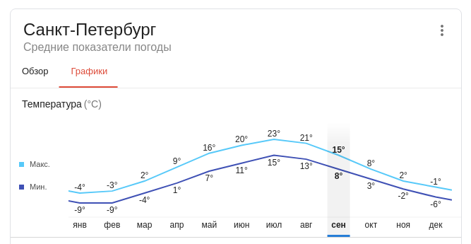

# Дано

Предположим, что есть однокомнатная квартира в хрущевке, площадь которых варьируется в пределах 31-33 м². Ограничимся первым значением. Высота потолков, предположительно, 2,48, но мы округлим до 2,5.

Температура за окном 0, межсезонье. Желаемая температура 20 градусов.

За средний вес кошки примем 3.5 кило.

# Задача

- Сколько нужно кошек для обогрева однокомнатной квартиры, при учёте что средняя температура обычной домашней кошки принимается за 38 градусов?

- Имеется ли тут логическая связь со стереотипами про сорок кошек, и есть ли шанс, что некоторые дальновидные персонажи таким образом просто собираются экономить на отоплении?

# Решение

Важно учесть, что при расчетах мы пользуемся ~помойкой~ интернетом, погрешность может быть на уровне от 2% до беляша.

## Параметры помещения

Рассчитаем объем помещения, умножив площадь на высоту:

31 м2 * 2.5 м = 77.5 м3

Речь идет о хрущевке, коэффициент теплоизоляции примем равным 2.0 [источник 1].

## Тепловые параметры кошки

К сожалению, не удалось найти достоверных измерений тепловых параметров домашних кошек [источник 2]:

>для взрослой кошки энергетическая потребность составляет 60–80 ккал на 1 кг массы тела

Следовательно, 3.5кг кошка потребляет 70 ккал * 3.5 кг = 245 ккал в сутки или 245 / 24 = 10.2 ккал/ч

Этого достаточно для расчетов, но для оценки адекватности значения перведем это в Вт/ч согласно соотношению [источник 3]:

Тепловыделение кошки со 100% КПД в Вт/ч: 10.2 ккал/ч * 1,163 ~= 12 Вт/ч, что видится адекватным значением.

Реалистичное значение тепловыделения (КПД) примем за сходное с человеческим, на уровне 40% [источник 5], что даёт нам реалистичное тепловыделение:

10.2 ккал/ч * 0.375 = 3.825 ккал/ч

## Формула расчета мощности обогрева

Мощность обогрева будем расчитывать с учетом желаемой разности температур по формуле: V x T x k = ккал/час [источник 1], где:

- V - объем обогреваемого помещения
- T - желаемая разность между температурами снаружи и внутри помещения
- k - коэффициент тепловых потерь

## Температура среды

Выясним температуру окружающей среды для текущей географической точки (Санкт-Петербург) [источник 4]:

В условиях задачи сказано "межсезонье", что строго говоря даёт нам 4 случая, а не 2. Вычислим средние значения температур для всех граничащих месяцев, взяв среднеарифметические значения для каждого месяца и среднеарифметическую границу между ними, а также округлим до целого, отбросив дробную часть:

| Межсезонье | Последний месяц уходящего сезона | Первый месяц приходящего сезона | Среднеарифметическое |
| ---            | ---     | ---     | --- |
| **зима-весна** | -3/-9   | +2/-4   | -3  |
| **весна-лето** | +16/+7  | +20/+11 | +13 |
| **лето-осень** | +21/+13 | +15/+8  | +14 |
| **осень-зима** | +2/-2   | -1/-6   | -1  |

Очевидно, в условии имелись в виду зимние смены сезона (т.к. 0 градусов достаточно близки к диапазону -1 .. -3 градуса), но мы рассмотрим два случая, условно "благоприятный" для летних границ и "неблагоприятный" для зимних.

### Благоприятный случай

Температура для межсезонных периодов составляет +13 и +14 градусов по Цельсию, усредним до +13.5 градусов и примем её за исходную температуру в помещении.

Разница температур составит:

20 - 13.5 = 6.5 градусов

Подставим значения в формулу:

77.5 * 6.5 * 2.0 = 1007.5 ккал/ч

1007.5 ккал/ч / 10.2 ккал/ч = 98.7 единиц, округлим до целого: 99 единиц

### Неблагоприятный случай

Температура снаружи составляет от -1 до -3 градусов, округлим это значение до -2.

Разница температур составит:

-2 - 20 = 22 градуса

Подставим значения в формулу:

77.5 * 22 * 2.0 = 3410 ккал/ч

3410 ккал/ч / 10.2 ккал/ч = 334.3 единицы, округлим до целого: 335 единиц.

# Ответ

1. Для обогрева указанного помещения до 20 градусов по Цельсию нам потребуется:

  | КПД      | Благоприятный случай | Неблагоприятный случай |
  | ---      | ---       | ---       |
  | **100%** | 99 кошек  | 335 кошек |
  | **40%**  | 248 кошки | 838 кошек |

2. Попытка греть квартиру кошками обречена на провал с практической точки зрения:

  - Указанное помещение не способно вместить требуемое количество кошек без существенного вреда для их жизнедеятельности

  - Отопление помещения традиционными средствами кратно выгодней с экономической точки зрения

# Источники данных

1. Коэффициент теплоизоляции: https://1poteply.ru/sistemy/obogrev-pomeshheniya.html
2. Исследование сухого кошачьего корма: https://pedtehno.ru/content/issledovanie-suhogo-koshachego-korma
3. Киловатт-час: https://ru.wikipedia.org/wiki/Киловатт-час
4. Погодные данные: https://google.com/
5. Тепловыделение человека: http://www.vokrugsveta.ru/article/195552/
